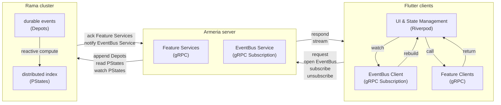

# Universal Multiplatform Fullstack

## Pitch

How would you build a multi-platform app that holds up for high-velocity, real-time products in an infinitely scalable way — and stays maintainable and efficient for smaller apps too?

Answer it once, and you get a standard architecture you can build any app on: cost-effective, future-proof, no rewrites, versatile enough to follow business-model pivots without throwing the foundation away.

This repository is that answer.

**State:** Architecture concept only, no production deployment displayed.

## Purpose

- Production-oriented template and reference implementation.
- Demonstrates how to build a universal, highly scalable, highly cohesive, real-time application.
- Structured for team scalability via feature slices, so independent teams can own and ship features in parallel.
- Supports many client platforms (including web) without treating the web stack as the default, reducing the risk of path dependencies that are costly to unwind later.
- Cloud-agnostic by design, so hosting can stay inexpensive and portable. No particular traffic shape is assumed; auto-scaling can be added when you need it.
- Highly compatible, covering ~99% of active iOS and Android devices (iOS 13+, Android 7+ (API 24+)) and ~98% of browsers in use (Chrome, Edge, Firefox, Safari 15.6+), with full support for HTTP/1.1 on web (still ~15% of browsing traffic).

## Architecture



### Integrated Distributed Compute & Storage: Rama

Teams still want to develop, deploy, and scale independently—but much of what people blame on "microservices" is really **infrastructure sprawl**: databases, caches, queues, stream processors, and CDC pipelines, each with its own ops, failure modes, and network hops. Traditional databases are built for one access pattern and push most computation elsewhere, which multiplies that sprawl and makes cross-service data hard to share without duplication or eventual consistency you did not ask for.

[Rama](https://redplanetlabs.com/docs/~/why-use-rama.html) is a different foundation: a log-first backend where **durable events**, **reactive compute**, and **indexed storage** are integrated and fully flexible. You are not locked to one datastore shape nor forced to add a specialized database for every access pattern. You model data the way your application thinks about it. You append domain events first; handlers update derived views and trigger side effects in the same system. So you are not choosing between "write to the DB now" and "publish to Kafka and hope".

When callers need a result, processing can be awaited and returned; when they do not, work runs reliably in the background. That reduces the glue between services (fewer stores to operate, clearer history than overwrite-only databases, less mocking in tests) while keeping service boundaries: APIs for clients and peers, **shared logs** for cross-team events without opening another team's database.

This template is built on Rama so you get that model out of the box. For the ideas behind it, see [The pain of microservices can be avoided, but not with traditional databases](https://blog.redplanetlabs.com/2026/03/31/the-pain-of-microservices-can-be-avoided-but-not-with-traditional-databases/) (Red Planet Labs, 2026).

**Full transparency:**
- Rama is not open source; license fees apply from two nodes upward.
- This repo currently runs an in-process dev cluster only, not a real multi-node deployment setup.

### Stable & Highly Compatible API Contracts: gRPC/gRPC-Web

On top of Rama as the storage and compute layer, we need a stable API contract as an explicit boundary: it surfaces capabilities to callers while keeping internals hidden. That contract must support both unary calls and streaming so clients can request a result when they need one and receive updates when reactive work produces new data. **gRPC** with protobuf is the best fit because it unifies those patterns in one stack and stays highly compatible across clients via **gRPC-Web**. The alternative—OpenAPI REST for unary calls and WebSockets for push—brings higher complexity and is less stable in practice.

### JVM Server & gRPC Host: Armeria

Serving that contract needs a JVM host: only the JVM Rama client supports [reactive streaming](https://redplanetlabs.com/docs/~/pstates.html#_reactive_queries) today. **[Armeria](https://armeria.dev/)** is the best fit we found—it runs both legacy and modern HTTP stacks and ships **gRPC** and **gRPC-Web** without extra glue.

### Real-Time Layer: EventBus Abstraction

On the web, especially under **HTTP/1.1**, concurrent connections per host are capped, so the real-time layer should use one long-lived stream instead of many. Bidirectional WebSockets proved brittle in practice and raised compatibility concerns; a unidirectional server stream is easier to run reliably and is easily supported on the web via gRPC-Web. Unary calls handle subscribe/unsubscribe, while a single connection pushes events from server to client. That pattern is this template's **event bus** abstraction.

### Multiplatform Frontend: Flutter

The frontend should be platform-agnostic from the start. **[Flutter](https://flutter.dev/)** is the best fit we found—it targets mobile, desktop, and web from one codebase, and teams that might go web-only later can still follow the same patterns when they build that frontend. It fits the **gRPC** stack cleanly, including **gRPC-Web** on browsers, with stable protobuf code generation instead of brittle OpenAPI generators. Flutter's rendering model is tuned for reactive data, so streamed updates can drive the UI with high fidelity by default.

### Reactive State & Dependency Injection: Riverpod

Streamed updates still need a state layer the UI can depend on without coupling widgets to gRPC and the event bus directly. **[Riverpod](https://riverpod.dev/)** is the pragmatic fit: little boilerplate, built-in dependency injection (unlike lighter options such as [signals](https://pub.dev/packages/signals)), and providers that wire cleanly into reactive Flutter UIs.

### High-Fidelity Integration Testing: Patrol

The stack still needs high-fidelity integration tests. **[Patrol](https://patrol.leancode.co/)** fits naturally with Flutter: tests stay in Dart, run headless in CI, and drive the real UI against a running backend. That is the best way we found to verify Rama's in-process simulation and the reactive path end to end.

### Identity, Push Notifications, Analytics: Firebase

As a simple option, to keep costs low and example integration easy, we chose Firebase for this template. It serves as a simple default pick, and is just a placeholder for whatever you may want to use.

### Repository layout

The sample app is a minimal **global timeline** (shared feed, chronological posts) with a gRPC API, organized by **feature slices**:

- [`backend/`](backend/) — Gradle project: protos under [`backend/src/main/proto`](backend/src/main/proto), JVM entrypoint [`Main`](backend/src/main/java/social/example/Main.java), shared EventBus plumbing under [`social.example.eventbus`](backend/src/main/java/social/example/eventbus/), and feature code under [`social.example.features.<feature>`](backend/src/main/java/social/example/features/timeline).
- [`frontend/`](frontend/) — Flutter project: protos in [`frontend/lib/proto`](frontend/lib/proto), UI under [`frontend/lib/features/<feature>`](frontend/lib/features/timeline).

## Getting Started

1. Install JDK **25** (latest LTS)
2. Install Flutter **3.41.x**
3. Install Node.js **22.x** or later
4. Install [Firebase CLI](https://firebase.google.com/docs/cli)
5. Install [asdf](https://asdf-vm.com/guide/getting-started.html)
6. Run setup: (details below)

```bash
./setup.sh
```

7. Run the auth emulator:

```bash
cd frontend && firebase emulators:start --only auth
```

8. Run the backend:

```bash
cd backend && ./gradlew runBackend
```

9. Run the frontend:

```bash
cd frontend && flutter run -d chrome
```

Context on `./setup.sh`:
- Installs [gitleaks](https://github.com/gitleaks/gitleaks) and [lefthook](https://github.com/evilmartians/lefthook) via [asdf](https://asdf-vm.com/)
- Runs `lefthook install`, registering [`lefthook.yml`](lefthook.yml), containing:
  - **post-merge** / **post-checkout**: re-run `./setup.sh` when hook/tooling config changes
  - **commit-msg**: [commit linting](.commitlintrc.json)
  - **pre-commit**: prevent merge conflict markers, [prevent secrets leaking](https://github.com/gitleaks/gitleaks), [generate protos](scripts/generate_dart_protos.sh), lockfile update, `build_runner`, formatting
  - **pre-push**: `dart analyze`, `flutter test`, backend `./gradlew check`, Patrol E2E (`web-headless`)

Optional — for Java Checkstyle in Cursor, run `./scripts/install_checkstyle_extension_cursor.sh`.

## Development

- For more details on running, launching or testing, see [launch configs](.vscode/launch.json).
- After changing protos:
  - Java stubs regenerate on `./gradlew build` from [`backend/`](backend/), so on restarting the backend.
  - Dart stubs need manual generation via `./scripts/generate_dart_protos.sh`.
